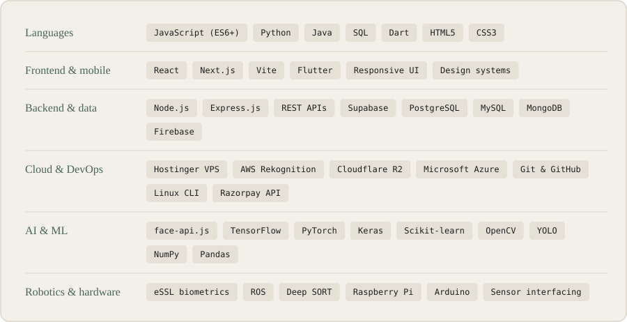
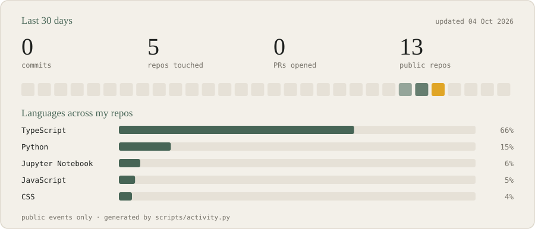

  

  <a href="https://sriram27102003.github.io/Portfolio/">Portfolio</a> ·
  <a href="https://linkedin.com/in/s-sriram-728945249/">Linkedin</a> ·
  <a href="https://sriram27102003.github.io/Portfolio/Sriram%20Resume%20Revised.pdf">Resume</a> ·
  <a href="mailto:winsriram962@gmail.com">E-mail</a>

  
  
  
  

 

| When | Role | What I did |
|---|---|---|
| **Apr 2026 → now** | Software Developer, **AJSolutions** | Sole engineer on three concurrent MSME products: a 16-module HRMS, a real-time wastage tracker and an equipment maintenance app. Proposals, architecture, VPS deployment, biometric hardware integration. |
| **Ongoing** | Co-builder & lead engineer, **Snaptrace · Unit3A** | Guests scan a QR, take a selfie and get every wedding photo they appear in. I own the camera-to-cloud pipeline, AWS Rekognition face matching and the Razorpay checkout. |
| **Sep 2025 → Mar 2026** | Frontend Developer Intern, **VIEntityData** | Shipped the resume builder, AI assessment and AI interview modules behind [intellihires.in](https://intellihires.in) and [ai.intellirecruits.com](https://ai.intellirecruits.com). |

| Project | What it does | Built with |
|---|---|---|
| **Snaptrace** | Selfie-to-photo matching for weddings, no app or OTP | `AWS Rekognition` `Cloudflare R2` `Node.js` `React` |
| **Annapoorna Mithai HRMS** | Payroll, eSSL biometric attendance, face-recognition check-in, 4-segment leave rules | `Supabase` `Node.js` `face-api.js` |
| **Energy & Wastage Tracker** | Shop-floor sensor and manual readings turned into cost dashboards | `MySQL` `Dashboards` |
| [**Lung-Cancer-Prediction**](https://github.com/Sriram27102003/Lung-Cancer-Prediction) | CNN plus dynamic hypergraph learning for early-stage classification | `TensorFlow` `Python` |
| [**Autonomous-Drone-Target-Tracking**](https://github.com/Sriram27102003/Autonomous-Drone-Target-Tracking-System) | Real-time human following on a Raspberry Pi | `ROS` `YOLOv3` `Deep SORT` |
| **Task Manager** | Cross-platform tasks with real-time sync | `Flutter` `Firebase` |

  

